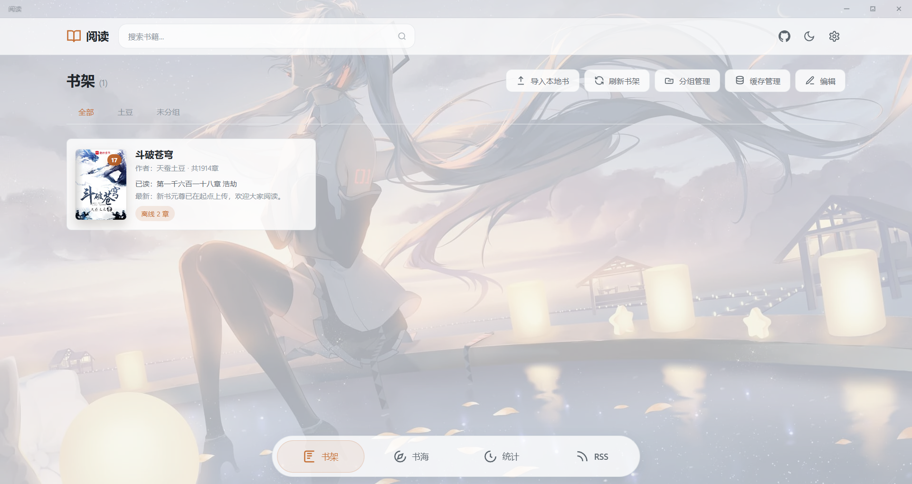
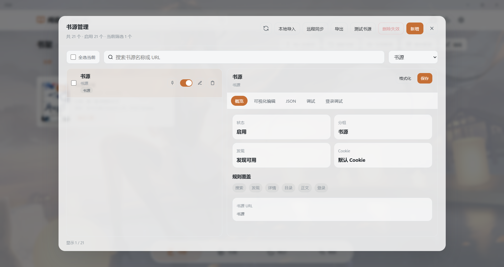

# Reader

[](https://github.com/hadc188/reader/releases)
[](https://github.com/hadc188/reader/actions/workflows/release.yml)
[](LICENSE)

> 一个面向桌面端的本地阅读器：管理自己的书源与书架，也能阅读本地书籍、订阅 RSS，并按喜欢的方式定制阅读界面。

Reader 是「阅读3.0」（[Legado](https://github.com/Rimchars/legado)）的跨平台桌面移植版，支持 Windows、macOS 和 Linux，使用 Rust、Tauri v2 与 Vue 3 构建。

项目采用纯单机设计，不需要部署服务端、数据库容器或注册账号。界面与本地核心运行在同一个桌面进程中，书架、阅读进度、缓存和配置由用户自己保存和管理。

项目源自 [reader](https://github.com/hectorqin/reader)，并参考 [reader-rust](https://github.com/givenge/reader-rust) 进行重构。

> [!IMPORTANT]
> 本项目不内置书源，也不提供任何书籍内容。首次启动后可导入自己拥有合法使用权的书源、本地 TXT 或 EPUB 文件。

## 界面预览

### 自定义书架



### 书源管理



### 沉浸阅读


## 项目亮点

- **本地优先**：不依赖常驻服务端，数据保存在自己的设备中。
- **兼容阅读生态**：支持 Legado 书源、RSS 源及备份数据的导入与恢复。
- **完整书源工具**：从导入、编辑、测试到登录调试都可以在桌面应用内完成。
- **可定制阅读体验**：阅读主题、字体、排版、翻页方式、背景图片与透明度均可调整。
- **多种听书方式**：支持系统语音及多种第三方语音接口格式。
- **跨平台发布**：自动构建 Windows、macOS 和 Linux 桌面安装包或便携包。

## 功能一览

### 书源、搜索与缓存

- 导入、导出、新增、编辑和批量测试 JSON 书源
- 远程书源订阅与一键同步更新
- 支持 CSS 选择器、JSONPath、XPath、正则表达式及 JavaScript 解析规则
- 多书源并行搜索，按书名和作者合并结果并显示来源数量
- 书籍详情、目录获取、换源、章节缓存与离线阅读
- 书源可视化编辑器、原始响应查看和分步骤规则调试
- 书源登录预览及 Cookie 登录状态支持

### 阅读体验

- 书架分组、最近阅读、书签和阅读进度记录
- 本地 TXT、EPUB 与网络书籍阅读
- 日间、夜间及多种阅读主题，可跟随应用外观切换
- 字体、字号、字重、行高、段距、缩进和页面宽度调节
- 滚动、左右翻页、点击翻页与自动阅读
- 简繁转换、文字选择、内容净化与自定义替换规则
- 自定义桌面背景，可选择是否应用到阅读页并调节透明度
- 阅读工具栏自动收起，鼠标靠近页面两侧即可展开

### 阅读数据与订阅

- 统计累计阅读时长、阅读字数和活跃天数
- 按时间范围查看每日阅读趋势及每本书的阅读时长
- RSS 源的本地导入、远程导入、编辑、订阅与文章阅读
- RSS 文章与普通书籍统一出现在最近阅读记录中

### 数据管理

- 本地备份、恢复及备份文件管理
- 与 Legado 互通书架、书源、RSS、书签、净化规则和阅读进度
- 支持旧版 JSON 备份以及新版 ZIP 备份
- 应用关闭时可选择直接退出或隐藏到系统托盘

## 快速开始

1. 前往 [Releases](https://github.com/hadc188/reader/releases) 下载适合当前系统的版本。
2. 启动应用后，导入合法书源或自己的 TXT、EPUB 文件。
3. 使用顶部搜索框查找书籍，将结果加入书架后开始阅读。
4. 在主页设置中调整外观、背景和关闭行为，在阅读设置中调整排版、主题、缓存与听书。

## 下载与平台

自动构建目前包含以下目标：

| 系统 | 架构 | 安装包 | 便携包 |
| --- | --- | --- | --- |
| Windows | x64 | NSIS | ZIP |
| macOS | Intel + Apple Silicon | DMG | APP 压缩包 |
| Linux | x64 | DEB | AppImage |

macOS 构建目前未使用苹果开发者证书签名，系统可能提示“无法验证开发者”，需要用户在系统安全设置中手动允许。Linux 桌面环境较多，如 AppImage 无法正常启动，可以尝试 DEB 包并检查系统 WebKitGTK 运行库。

Windows 便携版解压后可直接运行 `Reader.exe`。正式版本会优先在程序同级创建 `data/` 数据目录；如果安装位置不可写，则自动使用当前系统的用户数据目录。移动或卸载应用前，建议先在设置中创建备份。

## 听书设置

在小说阅读页打开右侧「阅读设置」，在「朗读引擎」中选择系统语音或 API 语音：

- **系统语音**：使用系统中已经安装的语音，可设置音色、语速、语调和定时停止。
- **API 语音**：请求由桌面端直接发出，支持 OpenAI、Fish、ElevenLabs、Azure 兼容格式，可设置语速、音频格式和定时停止。

API 语音需要填写对应服务商提供的配置：

| 接口格式 | 服务地址示例 | 模型或语言代码 | 语音音色 |
| --- | --- | --- | --- |
| OpenAI 兼容格式 | `https://api.openai.com` | 服务商提供的 TTS 模型 | 音色名称 |
| Fish 兼容格式 | `https://api.fish.audio` | 服务商提供的 TTS 模型 | 音色 ID |
| ElevenLabs 兼容格式 | `https://api.elevenlabs.io` | 服务商提供的 TTS 模型 | Voice ID |
| Azure 兼容格式 | Azure 语音资源地址 | 语言代码，如 `zh-CN` | 音色名称 |

服务地址既可以填写 API 根地址，也可以填写完整的语音接口地址。HTTP 代理只作用于 API 语音请求，可在无法直连服务时填写。

「少字多请求」能更及时地切换当前朗读段落；「多字少请求」可以减少请求次数，并根据音频播放进度估算高亮段落。

> [!WARNING]
> 访问密钥保存在本机阅读配置中，备份阅读配置时也会进入备份文件。请勿公开分享包含访问密钥的备份。

## 备份与恢复

在「设置 → 数据 → 本地备份」中可以创建、上传和恢复备份。新版备份使用 ZIP 格式，本应用也会继续识别旧版 JSON 备份。

本应用可以恢复 Legado 生成的 ZIP 备份；Legado 也可以读取本应用备份中的书架、书源、RSS、书签、净化规则与阅读进度。

由于不同设备及应用的本地文件路径不通用，跨应用恢复时只迁移网络书籍。本地书籍文件、Legado 专属界面配置、登录状态和缓存不会迁移；Reader 自己的阅读配置仅在 Reader 恢复时使用。

## 数据与隐私

- 应用没有集中式账号系统，书架、配置、缓存与阅读记录默认保存在本机。
- 搜索、正文加载和 RSS 订阅需要访问用户配置的来源网站。
- 使用 API 语音时，待朗读文字会发送给用户自己配置的语音服务商。
- 应用不会提供、维护或推荐任何第三方书源，用户应自行判断来源的安全性与合法性。

## 开发与构建

环境要求：Node.js 22、Rust stable，以及 Tauri v2 对应平台的系统依赖。

```bash
# 前端
cd frontend
npm install
npm run dev
npm run build
npm test

# 桌面应用
cd desktop
npm install
npm run dev
npm run build
```

开发模式由 `npm run dev` 同时启动 Vite 热更新和 Tauri 桌面窗口，数据保存在 `desktop/.dev-data/`。Windows 本地执行 `npm run build` 后，安装包和便携包位于 `desktop/dist/`。

Rust 库测试：

```bash
cargo test -j 4
```

推送 `v*` 标签后，GitHub Actions 会分别在 Windows、macOS 和 Linux 环境中构建，并创建草稿 Release。也可以在 Actions 页面手动运行构建，此时只生成可下载的工作流产物。

## 技术架构

- **桌面层**：Tauri v2，使用各系统自带的 WebView。
- **前端**：Vue 3、Vite、TypeScript、Pinia、Vue Router、ECharts。
- **本地核心**：Rust、Tokio、Reqwest、SQLx、SQLite、rquickjs。
- **通信方式**：前端通过 Tauri IPC 调用本地命令，封面与 EPUB 资源通过应用自定义协议加载。
- **数据存储**：SQLite 保存业务数据，文件目录保存封面、章节缓存、本地书籍和备份。

主要目录：

| 目录 | 说明 |
| --- | --- |
| `frontend/` | Vue 3 桌面界面、状态管理与前端测试 |
| `src/api/` | Tauri 命令、自定义协议与桌面接口 |
| `src/service/` | 书籍、书源、用户数据等业务逻辑 |
| `src/parser/` | CSS、XPath、JSONPath、正则和 JavaScript 解析引擎 |
| `src/crawler/` | 网络请求、请求头规则和 URL 分析 |
| `src/storage/` | SQLite、数据库迁移、文件缓存与数据目录 |
| `desktop/src-tauri/` | 桌面窗口、托盘、单实例、平台适配与打包配置 |

## 书源格式

书源使用 JSON 对象描述，常用字段包括 `bookSourceUrl`、`bookSourceName`、`searchUrl`、`exploreUrl`，以及 `ruleSearch`、`ruleBookInfo`、`ruleToc`、`ruleContent` 等规则组。

规则支持 `@css:`、`@json:`、`@xpath:`、`@regex:` 与 `js:` 前缀。JavaScript 规则由本地 rquickjs 引擎执行，导入不可信书源前仍应检查其中的请求地址与脚本内容。

## 参与项目

- 遇到问题时，请在 [Issues](https://github.com/hadc188/reader/issues) 中说明系统版本、应用版本、复现步骤和错误提示。
- 功能建议请尽量描述使用场景，以及希望解决的实际问题。
- 欢迎提交 Pull Request；提交前请运行前端测试、前端生产构建和 Rust 测试。
- 请勿在问题、日志或提交中上传访问密钥、Cookie、私人书源和包含个人数据的备份文件。

## 免责声明

本项目仅提供书源管理、内容解析、阅读与缓存等技术能力，不内置、存储、分发或提供任何受版权保护的书籍内容。用户应确保自行添加的书源、上传的本地文件以及通过本应用访问的内容均已获得合法授权，并自行承担由此产生的版权与合规责任。

如任何权利人认为本项目相关内容或使用方式侵犯了其合法权益，请通过项目 Issues 联系维护者，我们将在核实后及时处理。

## 开源许可

本项目基于 [MIT License](LICENSE) 开源。

## 致谢

感谢 [Legado](https://github.com/Rimchars/legado)、[reader](https://github.com/hectorqin/reader) 和 [reader-rust](https://github.com/givenge/reader-rust) 等开源项目提供的思路与基础。

特别感谢：[LinuxDO](https://linux.do/)。
